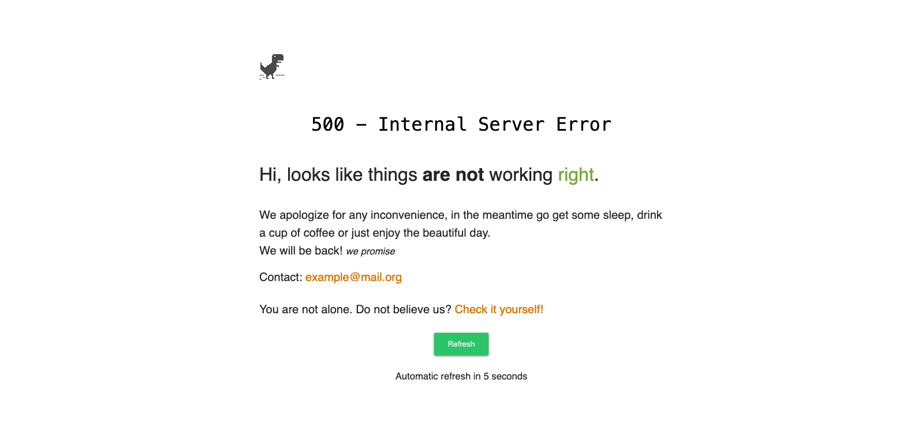

# Reusable error page




## Customize
In the `index.html` you can change following values in the `<script>` section.
* `contactEmail`
* `timeToRefreshInSeconds`
* `automaticRefresh`

## Setup
### NGINX
```shell
error_page 500 502 503 504 = @maintenance;
# error_page 500 = @maintenance;

location @maintenance {
  root /path/of/this/directory;

  try_files $uri /index.html =502;
}
```

